# Информационно-справочная система туристического агентства
## Описание проекта

Проект представляет собой информационно-справочную систему для туристического агентства, разработанную с использованием технологий Java, Spring Boot, Hibernate и MySQL. Цель системы — автоматизация ключевых бизнес-процессов, предоставление клиентам удобного инструмента для поиска и бронирования туров, а также обеспечение эффективного управления бронированиями, пользователями и аналитикой для сотрудников агентства.

Система предназначена для трёх категорий пользователей:

- **Клиенты**: регистрация, поиск туров, бронирование, отзывы.
- **Агенты**: управление турами, обработка заявок.
- **Администраторы**: управление пользователями, управление турами, статистические данные о пользователях и бронированиях.

## Функциональные возможности

### Клиенты:

- Регистрация и авторизация.
- Поиск туров с возможностью фильтрации по параметрам (цена, доступность, дата).
- Просмотр и бронирование.
- Оставление отзывов и оценок.

### Агенты:

- Добавление и редактирование туров.
- Управление бронированиями клиентов: подтверждение, отмена бронирований и т.д.
- Контроль доступности туров.

### Администраторы:

- Полный контроль над турами (добавление, редактирование, удаление).
- Управление пользователями: назначение ролей, удаление учётных записей.
- Анализ статистики: бронирования по месяцам, распределение пользователей по ролям.

## Технологический стек

- **Язык программирования**: Java 
- **Фреймворк**: Spring Boot.
- **База данных**: MySQL.
- **ORM**: Hibernate, JPA.
- **Веб-технологии**: HTML, CSS, JavaScript, Thymeleaf.
- **API**: RESTful.

## Архитектура системы

### Клиентская часть:

- Веб-интерфейс для взаимодействия пользователей с системой.
- Поддержка удобной навигации и интуитивно понятного интерфейса.

### Серверная часть:

- Обработка запросов пользователей.
- Реализация бизнес-логики (авторизация, фильтрация туров, управление бронированиями).
- Генерация аналитических данных.

### База данных:

- Хранение информации о пользователях, турах, бронированиях и отзывах.
- Поддержка сложных запросов и агрегирования данных.

## Описание интерфейса программы

Интерфейс информационно-справочной системы туристического агентства разработан с целью обеспечения интуитивно понятного и удобного взаимодействия пользователей с системой. Все страницы и элементы интерфейса организованы так, чтобы обеспечить доступ к ключевым функциям системы для разных категорий пользователей, включая клиентов, агентов и администраторов.

### 1. Страница авторизации

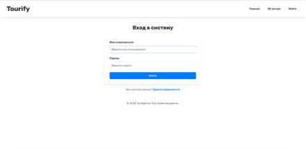

Страница авторизации является первой точкой входа в систему для пользователей. На этой странице пользователи вводят свои логин и пароль для доступа к личному кабинету. Если пользователь ещё не зарегистрирован в системе, то он может перейти на страницу регистрации. После успешного ввода данных происходит проверка учетных данных, и, если они верны, пользователь переходит на главную страницу системы.

### 2. Страница регистрации

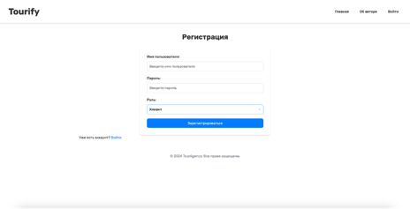

Страница регистрации предназначена для новых пользователей, которые хотят создать учетную запись в системе. В форме регистрации необходимо ввести имя пользователя, пароль и роль пользователя. После заполнения всех полей и отправки формы происходит создание нового аккаунта, и пользователь автоматически перенаправляется на страницу авторизации для входа в систему.

### 3. Главная страница

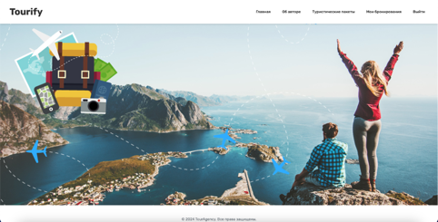

После успешной авторизации пользователи попадают на главную страницу системы. Это основная точка входа, с которой можно перейти к ключевым разделам системы, таким как управление турами, бронированиями, а также доступ к аналитическим данным для администраторов. На главной странице отображается приветствие пользователя и навигационное меню, позволяющее перейти к соответствующим разделам в зависимости от роли пользователя.

### 4. Страница управления турами

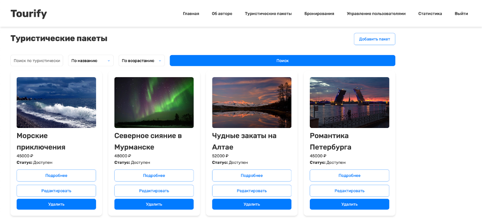

Страница управления турами предоставляет пользователям (в зависимости от их ролей) возможность добавлять, редактировать или удалять туристические пакеты. Пользователи могут увидеть список всех доступных туров, а также воспользоваться фильтрами для поиска по различным параметрам, таким как стоимость, продолжительность, доступность тура.

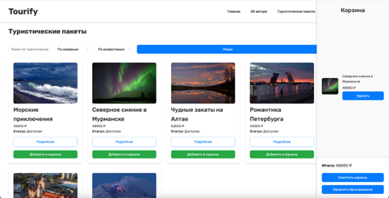

Страница клиента для добавления тура в корзину и оформления бронирования.

### 5. Страница заявок на бронирование

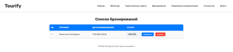

Здесь пользователи (в зависимости от роли) могут просматривать все заявки на бронирование, сделанные другими пользователями. Страница позволяет менять статус заявки (например, CONFIRMED, CANCELLED), а также удалять заявки, если это необходимо. Это важно для агентов, которые работают с запросами на бронирование, а также для администраторов, чтобы отслеживать все бронирования в системе.

### 6. Страница управления пользователями (для администратора)

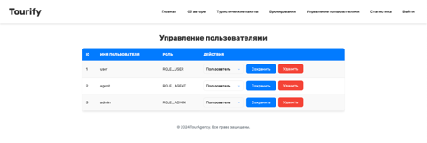

На этой странице администратор системы может управлять учетными записями пользователей. Это включает в себя возможность назначения ролей пользователям, удаление учетных записей, изменение информации о пользователях. Администратор может управлять всеми аспектами системы, что делает эту страницу ключевой для обеспечения безопасности и правильного функционирования системы.

### 7. Страница "Мои бронирования"

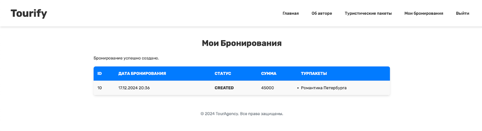

На этой странице пользователь может просматривать все свои бронирования, отслеживать их статус (например, "Подтверждено", "Отменено", "Завершено") и в случае необходимости отменить бронирование. Этот раздел позволяет пользователю управлять своими заявками и оставаться в курсе всех актуальных бронирований.

### 8. Подробное описание тура

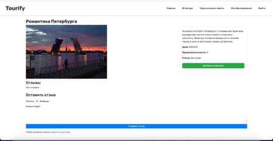

На странице подробного описания тура пользователи могут оставлять своё мнение о туристическом пакете, которые они приобрели и использовали. Каждый отзыв включает текст комментария и оценку тура по шкале от 1 до 5. Это помогает другим пользователям сделать осознанный выбор, а также даёт возможность для агентов и администраторов отслеживать качество услуг.

### 9. Страница статистики

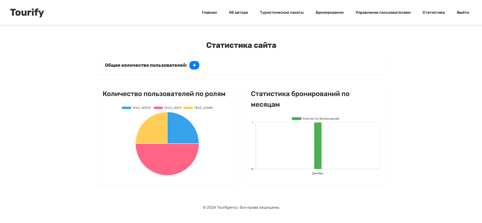

Для администраторов предусмотрены аналитические инструменты на странице статистики, которые отображают различные графики и диаграммы. Эти данные помогают анализировать общие показатели системы, такие как количество бронирований, распределение пользователей по ролям, динамику активности пользователей и другие важные метрики. Это помогает улучшить процессы и принимать обоснованные решения.

### 10. Страница "Об авторе"

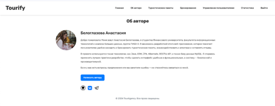

На этой странице пользователи могут ознакомиться с информацией о разработчике веб-приложения. Здесь представлены данные о студентке Финансового университета Анастасии Белоглазовой, а также контактные данные для связи. В разделе описана цель проекта, используемые технологии и подходы к разработке, а также предоставляется возможность задать вопросы или оставить предложения через email, VK и Telegram.

